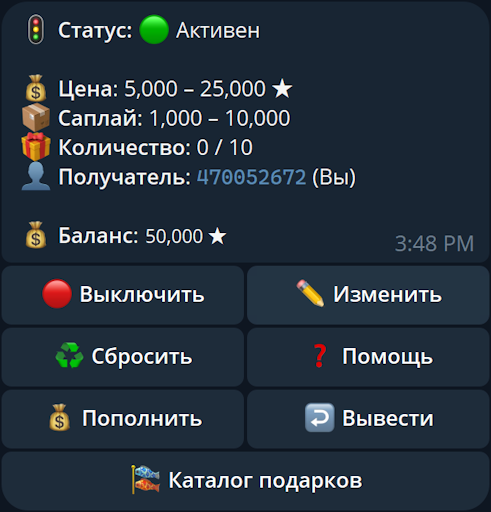

# 🎁 TelegramGiftsBot

Telegram-бот для покупки подарков из маркетплейса через Telegram API. Поддерживает фильтрацию, лимиты и автоматизацию действий. Никаких комиссий, исходный код скрипта доступен всем.

---

## 📦 Возможности

- Покупка подарков по заданным фильтрам: минимальная/максимальная цена, supply и количество покупок.
- Уведомления при успешных покупках и завершении задач.
- Управление через интерактивное меню прямо в Telegram.
- Настройка получателя подарков (по user_id для аккаунта или по username для канала).
- Счётчик покупок и автоматическая остановка при достижении лимита.
- Пополнение и возврат средств через Telegram Stars.
- Тест бота через покупку подарка за 15 звёзд.

---

## 🚀 Быстрый старт

**1. Клонируйте репозиторий:**
   ```bash
   git clone https://github.com/leozizu/TelegramGiftsBot.git
   cd TelegramGiftsBot
   ```

**2. Установите зависимости:**
   ```bash
   pip install -r requirements.txt
   ```

**3. Создайте файл `.env`**

  В корне проекта создайте файл с именем `.env`. Этот файл используется для хранения переменных окружения.

**Пример:**
```env
TELEGRAM_BOT_TOKEN="123456:abcdefghijklmnopqrstuvwxyz"
TELEGRAM_USER_ID="123456789"
```

- `TELEGRAM_BOT_TOKEN` — токен вашего Telegram-бота, полученный через [@BotFather](https://t.me/BotFather)
- `TELEGRAM_USER_ID` — ваш Telegram user ID (узнать можно через [@userinfobot](https://t.me/userinfobot))

**4. Запустите бота:**
   ```bash
   python main.py
   ```

## 📂 Структура

- `main.py` — основной скрипт бота
- `requirements.txt` — зависимости
- `.env` — файл с конфигурацией (не включается в git)

## 📸 Скриншот

Главное меню бота:  


---

## ☁️ Хостинг без сервера

Если вы не хотите разбираться с VPS и настройкой окружения — воспользуйтесь **готовым Telegram-хостингом**.

Бот [@GiftsHostingBot](https://t.me/GiftsHostingBot) позволяет подключить данный бот для покупки подарков за **пару секунд**.


### ⚙️ Как это работает?

1. Получите токен у [@BotFather](https://t.me/BotFather) (команда `/newbot`).
2. Откройте [@GiftsHostingBot](https://t.me/GiftsHostingBot) и отправьте команду `/addbot`.
3. Введите токен — бот будет активирован на сервере.

### 💡 Почему это удобно?

- Никакой установки и конфигурации
- Всё работает автоматически на сервере
- Можно подключить несколько ботов
- Доступно даже без технических знаний

### 🛡 Безопасность

- Токен никогда не сохраняется в открытом виде.
- Вы можете в любой момент отключить бота через [@BotFather](https://t.me/BotFather), команда `/revoke`.
- ☎️ Помощь с настройкой и хостингом: по запросу

---

## 🧑‍💻 Поддержка

- Telegram-аккаунт: [@leozizu](https://t.me/leozizu)
- Telegram-канал: [@pepeksey](https://t.me/pepeksey)

---

## 📜 Лицензия

Этот проект распространяется под лицензией MIT.
